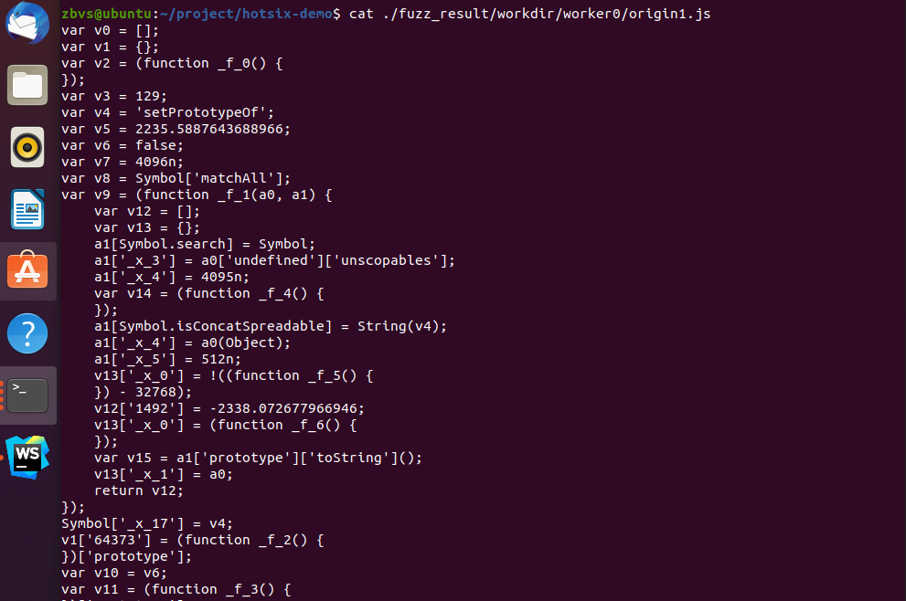

# 사용법
- 사용법 테스트는 우분투 20.04에서 테스트했습니다. 설치는 10~20초 가량 소요됩니다.

1. nvm을 설치한다.
```bash
$ sudo apt update && sudo apt install curl -y && curl -o- https://raw.githubusercontent.com/nvm-sh/nvm/v0.38.0/install.sh | bash && source ~/.bashrc
```

2. nodejs v16을 설치한다. ( nodejs 버전에 민감합니다. 16 버전을 설치해 주세요 )
```bash
$ nvm install 16.13.0
$ node --version
v16.13.0
```

3. hotsix를 내려받고 dependency를 설치한다.
```bash  
$ sudo apt install git -y && git clone https://github.com/zbvs/hotsix-demo && cd hotsix-demo && npm install
```

4. Main.js를 실행한다. 실행 시 그림과 같은 상태 창이 나타나면서 Fuzzing이 진행된다.
```bash  
$ node ./Main.js
```


- 다른 쉘을 열어 ./fuzz_result/workdir/worker{worker id}/ 경로에 origin1.js 파일이 빠르게 계속 재생성되고 있음을 확인할 수 있다. worker는 시스템의 코어 수 만큼 생성된다.
```bash
$ cat ./fuzz_result/workdir/worker0/origin1.js
```


- nodejs로 생성된 파일을 실행해 테스트해 볼 수 있다. 
```bash
$ node --allow-natives-syntax --expose-gc  ./fuzz_result/workdir/worker0/origin1.js
```
